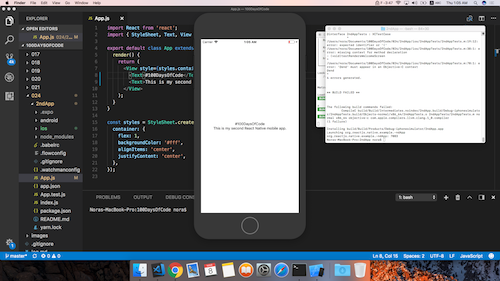

مدونة مئة يوم برمجة 

### اليوم الأول: ٤ فبراير، ٢٠١٨

* طبقت ودونت طريقة رفع المشاريع عبر واجهة الأوامر النصية لنظام Git

### اليوم الثاني: ٥ فبراير، ٢٠١٨

* راجعت أساسيات لغة الجافا سكربت
* بدأت [كورس](https://www.udemy.com/js-and-react-for-devs) جافاسكربت في Udemy وتعلمت في أول درس على  بنية التحكم في خصائص عناصر HTML (DOM)
* اطلعت على دليل الأنماط للغة الجافاسكربت من Airbnb

### اليوم الثالث: ٦ فبراير، ٢٠١٨

* بدأت بناء متحدث واتسون باللغة العربية
* استخدمت عناصر (Entities) عرفتها وعناصر معرفة من النظام مثل الأرقام 
* استخدمت (Slots) لحفظ رسالة المستخدم (مثل المشروب) و الرد على أساسه باستخدام الجمل الشرطية

### اليوم الرابع: ٧ فبراير، ٢٠١٨

* تعلمت استخدام Watson Discovery API
* طبقت القاعدة الثالثة من طريقة [The Twelve-Factor App](https://12factor.net/) وهي حفظ معلومات التهيئة مثل اسم المستخدم وكلمة المرور كمتغيرات بيئية في ملف بيئي منفصل عن ملف الكود
* استخدمت (.gitignore) حتى يتم تجاهل ملف المتغيرات البيئية وملف node_modules و package-lock عند رفع الكود إلى Git

    لكن واجهتني مشكلة رفع ملف المتغيرات    البيئية رغم كتابته في ملف .gitignore
    فتم حل المشكلة باستخدام هذا الأمر
    
    `git rm --cached .env`

### اليوم الخامس: ٨ فبراير، ٢٠١٨

* تعلمت استخدام معالجة الأحداث Event Handlers لتنفيذ مهمة معينة بناء على ضغط الزر أو المرور به
* أنشأت حدث مخصص Custom Event
* طبقت تغيير تنسيق صفحة الويب عند الضغط على الزر

### اليوم السادس: ٩ فبراير، ٢٠١٨

#### متحدث واتسون
* أكملت جزء من متحدث واتسون عبر إضافة الرد الشرطي
بحيث إذا رد المستخدم بأنه شرب كابتشينو يسأل كم كوب؟
وإذا كتب المستخدم قهوة عربية يسأل كم فنجال؟
* أردت سؤال المستخدم بعد ذلك إذا شرب مشروب ثاني أو لا
وإذا كانت الإجابة بنعم يفترض إعادة سؤال "ماذا شربت؟" لكن إلى الآن لم أتوصل لحل غير تكرار جزئية السؤال وأبحث عن حل أمثل

#### لغة الجافاسكربت
* حسنت من الحل السابق بناء على الحل المذكور في الكورس
* تعلمت التعامل مع أوامر غير متزامنة Asynchronous كعمليات الأجاكس 

### اليوم السابع: ١٠ فبراير، ٢٠١٨

* بنيت موقع يعرض نتيجة مناداة الواجهة البرمجية لموقع GitHub
* تعلمت إنشاء عناصر HTML في الواجهة عبر الجافاسكربت
* بقي إضافة مربع يكتب فيه المستخدم الاسم الذي يبحث عنه بدلاً من جعل النتيجة ثابتة
* قائمة المتابعون تحتاج إلى تنسيق

### اليوم الثامن: ١١ فبراير، ٢٠١٨

#### متحدث واتسون
* وجدت حل لتكرار جزئية السؤال عبر الواجهة الرسومية أو بتعديل كود JSON وأنوي كتابة مقال مفصل عنه بإذن الله

#### لغة الجافاسكربت
* حسنت الموقع الذي تم بناءه في اليوم السابع
    - واجهتني مشكلة
    
        `Cannot read property 'addEventListener' of null`

        وانحلت بنقل script من جزئية head إلى body 
* اختبرت اول اختبار قصير في الكورس وحصلت على ٧ من ١٠
* كتبت كود لتثبيت المفاهيم الجديدة في لغة الجافاسكربت مثل:
    - var, const and let
    - Scope and this
    - Call, Apply and Bind

### اليوم التاسع: ١٢ فبراير، ٢٠١٨
* تعلمت استخدام المعاملات الافتراضية في تعريف الدوال
* طبقت تفكيك `Destructuring` العناصر والمصفوفات
* استخدمت دليل الأنماط من Airbnb لكتابة التعليقات وتعريف المصفوفات والعناصر في الكود
* تعلمت كتابة الدوال السهمية `Arrow Functions`
* اختبرت الاختبار القصير الثاني في الكورس وحصلت على ٣ من ٤، والسؤال الذي لم أجيبه بشكل صحيح أول مرة يسأل عن مُخرج هذا الكود:

    `function newPrinter() {
    let x = 3.14;
    {
        console.log(x);
        let x = 1.41;
    }
    }`

    والإجابة الصحيحة أنه لا يطبع أي قيمة وإنما سيسبب مشكلة لأن المتغير `x` لم يتم تعريفه داخل الكتلة `block` قبل طباعته

### اليوم العاشر: ١٣ فبراير، ٢٠١٨

* أنهيت بناء الموقع الثاني في الكورس، والمخصص لعرض صور نتائج مناداة الواجهة البرمجية لناسا طبقت فيه الدروس السابقة من معالجة الأحداث، والمهام الغير متزامنة، والمعاملات الافتراضية، وتفكيك العناصر.

    بالنسبة لتنسيق عرض الصور استخدمت أحد المشاريع المفتوحة المصدر في [CodePen](https://codepen.io/)

### اليوم الحادي عشر: ١٤ فبراير، ٢٠١٨

* تعلمت استخدام مدير الحزم `package manager`: `npm` و `yarn`
* استخدمت أداة البناء `Grunt` لتتبع التغييرات في الكود

### اليوم الثاني عشر: ١٥ فبراير، ٢٠١٨
* تعلمت استخدام أداة البناء `Gulp`
    فيه فرق بين `Gulp` و `Grunt` في جملة الطباعة
    المهمة في `Gulp` يا إما تطبع مخرجات أو ترجع متغيرات
    تشبه الا `Promise` من ناحية أن المخرج من الدالة الأولى هوالمدخل للدالة التالية
* طبقت إنشاء مهمة `html` عبر `Gulp` في موقع Portfolio لإنشاء صفحة `index.html`
* تعلمت كيفية إنشاء مكوّنة `Component` في `React`

### اليوم الثالث عشر: ١٦ فبراير، ٢٠١٨

* تعلمت دورة حياة تطبيق React
* طبقت إنشاء تطبيق React تلقائيا عبر مكتبة create-react-app من فيسبوك
* استخدمت مكتبة mousetrap لمناداة دوال بناء عند الضغط على أزرار معينة في لوحة المفاتيح 
* طبقت استخدام State لحفظ المتغيرات

### اليوم الرابع عشر: ١٧ فبراير، ٢٠١٨

* حليت تحدي الدرس ٥٦ وهو إضافة مربع إدخال وإرسال النتيجة إلى مكوّنة كونامي
* تعلمت أنواع المكوّنات: مكونات للعرض  Presentational Components، ومكونات حاوية Container Components.
* اجتزت الاختبار الخامس في الكورس
* اطلعت على مقدمة المشروع النهائي للكورس

### اليوم الخامس عشر: ١٨ فبراير، ٢٠١٨
* بدأت في تصميم وبرمجة مكونات المشروع النهائي، والهدف من المشروع بناء موقع لكتابة الملاحظات بلغة markdown وعرضها وحفظها.

* استخدمت مكتبة `milligram` للتنسيق و `react-simplemde-editor` لإضافة محرر الملاحظات.

### اليوم السادس عشر: ١٩ فبراير، ٢٠١٨
* تعلمت وطبقت التخزين المحلي مثل ما شُرح في [هذا الفيديو](https://www.youtube.com/watch?v=ZZS1irWSfxc)
* تعلمت كيفية إرسال نص الملاحظة وطباعته وحفظه في متغيرات التطبيق. المشكلة حالياً هي مناداة دالة التغيير في كل مرة يزيد فيها المستخدم حرف وأظن الأمثل مناداتها فقط عندما يتوقف عن الكتابة.

### اليوم السابع عشر : ٢٢ فبراير، ٢٠١٨
* أكملت المشروع النهائي لكورس React في Udemy.
* تم ربط كل ملاحظة برقم تعريفي حتى يسهل الرجوع لها وتعديلها
* تم حفظ الملاحظات وعرضها في القائمة الجانبية

### اليوم الثامن عشر: ٢٤ فبراير، ٢٠١٨
* رأيت [فيديو](https://www.youtube.com/watch?v=vYquumk4nWw) يشرح البرمجة الدايناميكية ومبدأ الاستذكار  `Memoization` وطبقته في حل مشكلتين برمجية رياضية حول عدد فيبوناتشي.

### اليوم التاسع عشر: ٢٦ فبراير، ٢٠١٨
* أكملت تطبيق نفس المبدأ لحل مشكلتين رياضية لحساب مضروب العدد.

### اليوم العشرون: ٢٧ فبراير، ٢٠١٨
* اطلعت على أحد مشاكل hashcode السابقة لقوقل والتي كان جزء من حلها حساب المسافة بين نقطتين فحللت مشكلة مشابهة في موقع UVa Online Judge. استخدمت المصفوفة لحفظ النفاط لكن كانت لا تستجيب في حال كانت الأعداد كبيرة فلذلك استخدمت vectors. وعندما سلمت الحل أول مرة، وصلتني رسالة بأن الحل خاطئ، فاكتشفت أن الخطأ كان بسبب افتراض أن نقطة س و ص عدد صحيح دائما، لكن السؤال لم يذكر ذلك، فعندما حولت المتغير إلى عدد عشري، قبلت الإجابة.

### اليوم الواحد والعشرون: ٢٤ فبراير، ٢٠١٨

* بدأت ببناء أول تطبيق جوال باستخدام React Native
* اختبرت التطبيق على جوالي باستخدام Expo

### اليوم الثاني والعشرون والثالث والعشرون: ٢٨ فبراير و ١ مارس، ٢٠١٨
* استعداد للمشاركة مسابقة hashcode عبر تجربة استخدام المكتبات والتحويل بأنواع المتغيرات بلغتي Java و C++
* شاركت بمسابقة hashcode وعملت مع الريم لحل المشكلة المطروحة، انتهى الوقت قبل إكمال الحل، لكن بما أنه تم تمديد المدة نأمل في أن نكمل الحل لاحقاً.

### اليوم الرابع والعشرون والخامس والعشرون: ١ و ٢ مارس، ٢٠١٨
* اختبرت التطبيق على محاكي iOS
* استخدمت المكونات الأساسية مثل مربع النص
* أضفت زر و ربطته بدالة عند الضغط عليه
* استخدمت state لتعريف المتغيرات وتعديلها في البرنامج

### اليوم السادس والعشرون: ٩ مارس، ٢٠١٨
* طورت موقع إلكتروني عبر إطار عمل Bootstrap

### اليوم السابع والعشرون: ١٥ مارس، ٢٠١٨
* تعلمت الفروق بين أطر تعلم الآلة مفتوحة المصدر لاختيار إطار يتم فيه تطوير خوارزمية لتصنيف الصور ومن ثم ربطه بتطبيق الجوال
* اطلعت على جميع خوارزميات التصنيف والفروقات بينها وكيفية استخدامها بشكل مبدئي بلغة البايثون
* نزلت TensorFlow وعملت برنامج hello world
* نسخت روابط صور زهور دوار الشمس وزهور الأضاليا من موقع ImageNet لتجربة تصنيف الصور عليها
* كتبت كود بايثون لتحميل الصور من الملف المحتوي على روابط الصور تلقائيا

### اليوم الثامن والعشرون: ١٦ مارس، ٢٠١٨
* أكملت ما بدأته في اليوم الخامس وشغلت كود البايثون لتحميل الصور
* حملت مشروع tensorflow-for-poets-2 اتبعت [هذا](https://codelabs.developers.google.com/codelabs/tensorflow-for-poets/?utm_campaign=chrome_series_machinelearning_063016&utm_source=gdev&utm_medium=yt-desc#0) التتوريال لتدريب المصنف و تصنيف الصور

### اليوم التاسع والعشرون: ١٧ مارس، ٢٠١٨
* أردت تطبيق التصنيف على نوع آخر من الصور، فبدأت بتحميل الصور
* حذفت المجلدات المحتوية على أقل من ٣٠ صورة وهو الحد الأدنى لمصنف tensorflow
* بعض المجلدات تحتوي على مجلدات داخلية، أردت دمج الصور داخل المجلدات الفرعية إلى المجلد الرئيسي، فواجهت مشكلة تطابق الأسماء رغم اختلاف الصور، فاستخدمت هذا الكود لإضافة اسم المجلد الفرعي إلى أسماء الصور داخله تلقائيا 
`for i in *; do name="${i%.*}"; mv "$i" "${name}suffix${i#$name}"; done`
* تم تدريب المصنف واختباره وللأسف النتيجة كانت بعيدة عن الصحة فاخترت تأجيل المشروع إلى أن أحصل على بيانات أكبر وأكثر دقة

### اليوم الثلاثون: ١٨ مارس، ٢٠١٨
* خارج وقت الدوام أنشأت حساب في GitHub لجمع المشاريع التي نقدمها في الدورات والمحاضرات 
* تعلمت أكثر عن استخدام Git عبر موجه الأوامر للمساهمة في مشاريع مفتوحة المصدر خلال هذه المبادئ:
Fork -> Clone -> Branch -> Push -> Pull Request. 
Pull = Fetch + Merge
origin = your GitHub fork of the project.
upstream = the main project's GitHub repository.
* واجهتني هذه المشكلة[هذه المشكلة](https://stackoverflow.com/questions/23344320/there-isnt-anything-to-compare-nothing-to-compare-branches-are-entirely-diffe) أثناء تتبعي [هذه المقالة التعليمية](https://akrabat.com/the-beginners-guide-to-contributing-to-a-github-project/) والسبب أني كنت أنسى عمل commit & push بعد القيام بالتعديل فلذلك دائماً يظهر لي هذا الخطأ
`There isn't anything to compare`

### اليوم الواحد والثلاثون: ١٩ مارس، ٢٠١٨
* أضفت تعديلات على عدة مشاريع في حساب DevExCodeHub
* وثقت مشروع Candy Machine with Feelings

### اليوم الثاني والثلاثون: ٢٤ مارس، ٢٠١٨
* بدأت بتصميم واجهات لتطبيق جوال بلغة سويفت 
    - الواجهة الأولى عبارة عن مربع نص يدخل فيه المستخدم حسابه في تويتر وزر يضغط عليه للانتقال للواجهة الثانية
    - الواجهة الثانية عبارة عن جدول من عدة صفوف، كل صف يحتوي على ٣ خلايا، وكل خلية تحتوي على صورة كتاب وعنوانه الرئيسي وتصنيفه
* ربطت مربع النص والزر بالكود، وانتقلت للواجهة الثانية عبر storyboardID
* بدأت بالبحث عن APIs توفر البحث عن كتب حسب التصنيف وجربت بعضها
* بعد اختيار Google Books API بحثت عن طريقة أعرف فيها التصنيفات الموجودة لكن حسب نتيجة بحثي هالخاصية غير متوفرة
* واجهتني مشكلة عدم ظهور placeholder في مربع النص وحسب ردود المطورين أنها مشكلة في المحاكي لكن يظهر عند اختباره على جهاز واقعي
* أضفت الانتقال إلى الواجهة الثانية إذا ضغط المستخدم زر done في الكيبورد
* أكثر شي صعب علي فهمه أثناء الانتقال من لغة objc إلى سويفت هي علامة الاستفهام والتعجب ومازلت أتعلم عنها أكثر
* تعلمت الفرق بين [print() vs println() vs NSLog()](https://stackoverflow.com/questions/25951195/swift-print-vs-println-vs-nslog) 

### اليوم الثالث والثلاثون: ٢٥ مارس، ٢٠١٨
* بدأت بتعلم كيفية استخدام الواجهات البرمجية ومناداتها بشكل غير متزامن
* طبقت تحليل عناصر JSON بلغة سويفت

### اليوم الرابع والثلاثون: ٢٦ مارس، ٢٠١٨
* حللت عناصر JSON المتداخلة (nested) وحولتها إلى مصفوفة من الكتب 
* تم تغيير الواجهة من جدول يحتوي فيه كل صف على ثلاث خلايا إلى Collection View
* أضفت الكود المناسب للواجهة الجديدة وهو كلاس من نوع Collection View Controller
* واجهتني [هذه المشكلة](https://stackoverflow.com/questions/30249692/collectionview-fatal-error-unexpectedly-found-nil-while-unwrapping-an-optional) لعرض الصور في البداية

### اليوم الخامس والثلاثون: ٢٧ مارس، ٢٠١٨
* واجهتني مشاكل كثيرة لتعديل حجم الخلية كون تعديل الحجم في الواجهة لم يظهر أثره في الجهاز، فأضفت التعديل في الكود
* عدلت عدد الأقسام إلى ٣ ويعبر عن عدد الخلايا بالصف الواحد

### اليوم السادس والثلاثون: ٢٨ مارس، ٢٠١٨
* تعاملت مع النصوص وكيفية المرور عليها في مصفوفة أو دمجها
* استخدمت NSUserDefaults لتحديد أول مرة يتم فيها تشغيل التطبيق
* تحديد التاريخ من الجوال لإرساله إلى أول واجهة برمجية وهي Watson Personality Insights
* استخدمت UIAlertController لإرسال نص المشكلة في حال لم يتم الاتصال بشكل صحيح

### اليوم السابع والثلاثون: ٢٩ مارس، ٢٠١٨
جربت عدة مكتبات لسحب التغريدات من حساب معين مثل:
AlamoFire, Twitter Framework, Twitter REST API, TwitterKit

### اليوم الثامن والثلاثون: ٣١ مارس، ٢٠١٨
* أضفت Completion Handler للدوال المسؤولة عن سحب التغريدات أو إرسالها إلى واتسون
وهي عبارة عن دالة يتم تنفيذها بعد الحصول على نتيجة من الواجهة البرمجية
* عملت دالة لتنقية التغريدات من المنشن والروابط وعلامات الترقيم

### اليوم التاسع والثلاثون: ١ أبريل، ٢٠١٨
* استخدمت مكتبة Swifter لسحب التغريدات

### اليوم الأربعون: ٥ أبريل، ٢٠١٨
* حسنت من دالة تنقية التغريدات من المنشن والروابط وعلامات الترقيم
* تعلمت استخدام العبارات القياسية في سويفت
* فتحت issue في مكتبة سويفتر كون دالة البحث لا ترجع أكثر من ٥-٧ تغريدات، وأغلقتها في نفس  اليوم لأني اكتشفت أن هذا نتيجة تحديث من تويتر لا يسمح بالبحث عن تغريدات قبل أكثر من ٧ أيام إلا عند التسجيل في حساب مدفوع للشركات

### اليوم الواحد والأربعون: ١٣ أبريل، ٢٠١٨
* استخدمت Map, Colors, Static Arrays

### اليوم الثاني والأربعون: ١٤ أبريل، ٢٠١٨
* تعلمت على طريقة التطوير [MVC](https://www.youtube.com/watch?v=Xqnp91MGP64) بلغة السويفت وأعدت هيكلة التطبيق بناء عليها
* حللت نتيجة مناداة خدمة واتسون بشكل مفصل

### اليوم الثالث والأربعون: ١٥ أبريل، ٢٠١٨
* أكملت تنفيذ طريقة التطوير [MVC](https://www.youtube.com/watch?v=Xqnp91MGP64) بلغة السويفت
* تعلمت كيفية تحديث بيانات الكولكشن فيو وإرسالها للواجهة قبل الانتقال إليها
* تعلمت كيفية البحث عن مفتاح في الرد الذي يصل بلغة جيسون

### اليوم الرابع والأربعون: ١٦ أبريل، ٢٠١٨
* عدلت تصميم التطبيق وألوانه
* أرسلت نتيجة مناداة خدمة واتسون إلى الواجهة البرمجية لكتب قوقل وعرضت النتيجة في الواجهة

### اليوم الخامس والأربعون: ١ مايو، ٢٠١٨

* بدأت تحدي جافاسكربت لثلاثين يوم
* أنهيت برمجة موقع يشغل صوت حسب كود زر الكيبورد اللي تضغطه `data-key`

### اليوم السادس والأربعون: ٢ مايو، ٢٠١٨

* تعلمت استخدام `transform` & `rotate` لتحريك عقارب الساعة
* استخدمت دالة `set interval` لتحريك الساعة كل ثانية

### اليوم السابع والأربعون: ٣ مايو، ٢٠١٨

* تعلمت تعريف واستخدام متغيرات CSS
* تعلمت استخدام `dataset` وتغيير خصائص عناصر CSS عبر دالة `setProprty`

### اليوم الثامن والأربعون: ٤ مايو، ٢٠١٨
* استخدمت الدوال الخاصة بالمصفوفات
- filter, map, sort and reduce

### اليوم التاسع والأربعون: ٥ مايو، ٢٠١٨

* اليوم برمجت تغيير حالة العناصر في CSS بلغة الجافاسكربت
* استخدمت flex لتقسيم حجم الصور بالتساوي على حجم الشاشة

### اليوم الخمسون: ٨ مايو، ٢٠١٨

* التحدي السادس هو برمجة موقع بمحرك بحث ذكي يقترح لك نصوص حسب إدخالك

### اليوم الواحد والخمسون: ٩ مايو، ٢٠١٨
* التحدي السابع يشبه للتحدي الرابع في اليوم الثامن والأربعون، كونه عن التعامل مع المصفوفات.
الدوال المستخدمة: some, every, find, findIndex and slice.

### اليوم الثاني والخمسون: ١٠ مايو، ٢٠١٨

* تعلمت في التحدي الثامن كيفية استخدام صفحة الويب كلوحة رسم، والتفاعل مع المستخدم عند الضغط أو السحب، وتنسيق الألوان.
استخدمت موقع [Mothering HSL](http://mothereffinghsl.com/) لمعرفة نقطة البداية والنهاية لخاصية hue, saturation and lightness.

### اليوم الثالث والخمسون: ١١ مايو، ٢٠١٨
* في التحدي التاسع، شرح لكيفية  الاستفادة القصوى من وظائف الكونسل `console` مثل السلاسل النصية المقولبة `Template Strings` وتنسيق النصوص المطبوعة في الكونسل، وطباعة معلومات، أو تحذير، أو مشكلة، ومن ثم طباعة الوقت المستغرق لتنفيذ دالة معينة.

### اليوم الرابع والخمسون: ١٢ مايو، ٢٠١٨

* التحدي العاشر كان عبارة عن عمل قائمة تحوي عدة مربعات اختيار، ثم إتاحة اختيار قائمة من الخيارات عبر الضغط على الاختيار الأول والأخير في القائمة مع الاستمرار بالضغط على زر Shift.

### اليوم الخامس والخمسون: ١٣ مايو، ٢٠١٨

* التحدي الحادي عشر ممتع، عن إنشاء مشغل فيديو، وتحديث شريط العرض حسب الوقت الفعلي، وإضافة دالة لتقديم الفيديو وتأخيره، أو تعديل الصوت.

تعلمت استخدام العبارة الشرطية `&&` بدل `if` ووضع الدالة كشرط ثاني، بحيث إذا تحقق الشرط الأول يتم تنفيذ الدالة، وإذا لم يتحقق لم تتنفذ.

* بدأت ببناء موقع شخصي

### اليوم السادس والخمسون: ١٤ مايو، ٢٠١٨
* التحدي الثاني عشر عبارة عن تطبيق لكود معروف يسمى بـ`KONAMI Code` وسبق وطبقته في كورس يوديمي في اليوم الثالث عشر.

### اليوم الواحد والخمسون: ١٥ مايو، ٢٠١٨

* التحدي الثالث عشر ممل بالنسبة لي، لأن حركة الكائنات برأيي غير مهم تعلمها في البداية، في التحدي تم برمجة الموقع لإظهار الصور بالمقال عبر حركة Slide In

### اليوم الواحد والخمسون: ١٦ مايو، ٢٠١٨

* في التحدي الرابع عشر، تعلمت الفرق بين نسخ المتغيرات والمصفوفات وبين استخدامها كمرجع `reference`

### اليوم الواحد والخمسون: ١٧ مايو، ٢٠١٨

* التحدي الخامس عشر كان عبارة عن التخزين المحلي، أيضاً سبق واستخدمته في كورس يوديمي.

التحدي أيضاً شرح مبدأ `Event Delegation`
> Event delegation allows you to avoid adding event listeners to specific nodes;  instead, the event listener is added to one parent

### اليوم الواحد والخمسون: ٢٢ مايو، ٢٠١٨

* التحدي السادس عشر عبارة عن تنسيق النص حسب المرور عليه

### اليوم الثاني والخمسون: ٢٣ مايو، ٢٠١٨

* في التحدي رقم ١٧: طبقت مرة أخرى عمل قائمة وإتاحة البحث عن اسم داخل القائمة لكن بترتيب الأسماء بعد حذف أل التعريف

### اليوم الثالث والخمسون: ٢٤ مايو، ٢٠١٨
* أكملت الدرس الثامن عشر وهو عبارة عن عرض قائمة بالفيديوهات وحساب مدتها

### اليوم الرابع والخمسون: ٢٧ مايو، ٢٠١٨
* عملت على تطوير وترجمة شات بوت في مجال الخدمات المصرفية مربوط بخدمة واتسون للديسكفري

### اليوم الخامس والخمسون: ٣١ مايو، ٢٠١٨
* بدأت بتطوير بلوكتشين في مجال التجارة، سأقوم بنشر تفاصيله قريباً بإذن الله

### اليوم السادس والسابع والخمسون: ٥ و ٦ يونيو، ٢٠١٨
* عملت على تطوير ديمو لاستخدام واتسون ستديو لبناء مودل تعلم آلة، واستخدام jupyter notebook لتحليل البيانات، وبناء نموذج التعرف البصري في مجال صناعة النفط والغاز

### اليوم الثامن والخمسون: ١١ يونيو، ٢٠١٨
* رتبت ملفات تطبيق كورس الجافاسكربت ورفعتها [كمشروع مستقل](https://github.com/xnorax/javascript-and-react)

### اليوم التاسع والخمسون: ١٦ يونيو، ٢٠١٨
* أضفت على الموقع الشخصي كود الاشتراك بالقائمة البريدية، وتعلمت ربطه بـ`mailchimp`

### اليوم الستون: ١٧ يونيو، ٢٠١٨
* عملت التحدي رقم 19، وطبقت فيه استخدام `Webcam` لتصوير الفيديو وأخذ صورة منه وتحميلها وعمل فلترات لتغيير ألوان الصورة عن طريق التعامل مع البكسلات

### اليوم الواحد والستون: ١٨ و ١٩ يونيو، ٢٠١٨
* عملت على مشروع بلغة السويفت وخدمات واتسون سأنشره عند اكتماله
- استخدمت مكتبة `Eureka` لإنشاء `form`
- استخدمت navigation
- استخدمت `AVFoundation` لتصوير فيديو وأخذ صورة
- تعاملت مع خدمة واتسون Visaul Recognition

### اليوم الثاني والستون: ٢٠ يونيو، ٢٠١٨
* كملت على الموقع الشخصي اللي بدأت فيه، استخدمت ejs للواجهات بدلاُ من html، وغيرت هيكلة بعض الأجزاء وتنسيقها.

### اليوم الثالث والرابع والستون: ٢١ و ٢٢ يونيو، ٢٠١٨
* أكملت عمل مشروع السويفت، انحلت مشكلة المصادقة مع خدمة واتسون للتعرف البصري
بالإضافة لاستخدام خدمة واتسون للترجمة
نسقت الـnavigation controller
وأضفت أي نص لمشكلة أو تنبيه في ملف نصوص مستقل عن الكود
أضفت مربع التحميل بحيث يغطي كل الشاشة

### اليوم الخامس والستون: ٤ يوليو، ٢٠١٨ 
بدأت تعلم التحدي العشرين والواحد والعشرين لتسجيل الصوت وتحديد المكان عبر
- geolovation
- coordinates

### اليوم السادس والستون: ١٥ يوليو، ٢٠١٨
بدأت تنفيذ بعض التحديات اللي ما كفاني الوقت سابقاً لتنفيذها، وحدثت توثيقها وأضفت صورها هنا. في اليوم السابق، كنت في الطيارة وما عندي انترنت فما قدرت أختبر التطبيق على سيرفر، لما جربت اليوم حصلت لي مشكلة بسبب تسمية المغيرات بأسماء متشابهة، مااكتشفت ان الخطأ بحرف بالاسم إلا متأخر :)

### اليوم السابع والستون: ١٦ يوليو، ٢٠١٨

- مثل اليوم السابق أكملت التحديات السابقة وتوثيقها، وبدأت التحدي الثاني والعشرين.

### اليوم الثامن والستون: ١٧ يوليو، ٢٠١٨
- طبقت على كورس في مجال تعلم الآلة، باستخدام لغة بايثون لجمع البيانات عن مقالات في مجال السفر و الفنون وتصنيف النصوص تلقائياً.

### اليوم التاسع والستون: ١٨ يوليو، ٢٠١٨
- عملت على إكمال الموقع الشخصي، وإضافة اللغة العربية والإنجليزية للموقع، بالإضافة لبعض التعديلات على مظهر الصفحة والمحتوى.

### اليوم السبعون: ١٩ يوليو، ٢٠١٨

- تعلمت في التحدي الرابع والعشرين كيفية تعديل عرض المقال وتثبيت القائمة العلوية حسب حركة المستخدم

### اليوم الثمانون إلى المئة: ٢٠ يوليو-٣٠ ديسمبر، ٢٠١٨
  
  

- توقفت عن التدوين لكن عملت على ثلاث مشاريع رئيسية
    - موقع Code for Girls
    - عدة أمثلة على البلوكشين - استخدمت الجافاسكربت في برمجة العمليات
    - أكملت الثلاثين تحدي
وسأدون ملخص التحدي بإذن الله في موقع عالم البرمجة

